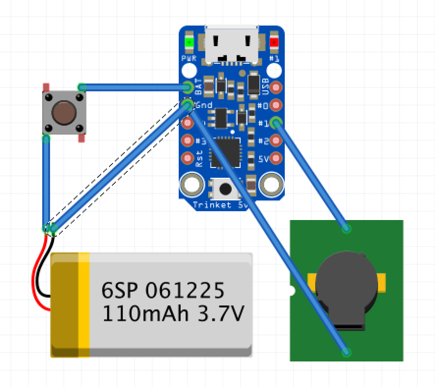

The Fartlek Machine

*Adafruit Arduino Trinket and an active buzzer*

> Fartlek, which means "speed play" in Swedish, is a training method that blends continuous training with interval training.

https://en.wikipedia.org/wiki/Fartlek

The Fartlek Machine will automatically generate a random iterval between 15 seconds and up to 2 minutes. Each interval begins with a series of beeps denoting the length of the interval. A short beep followed by a long beep indicates the end of the interval and a period of rest follows equally long as the interval. Then the process starts over. Beep beep!
